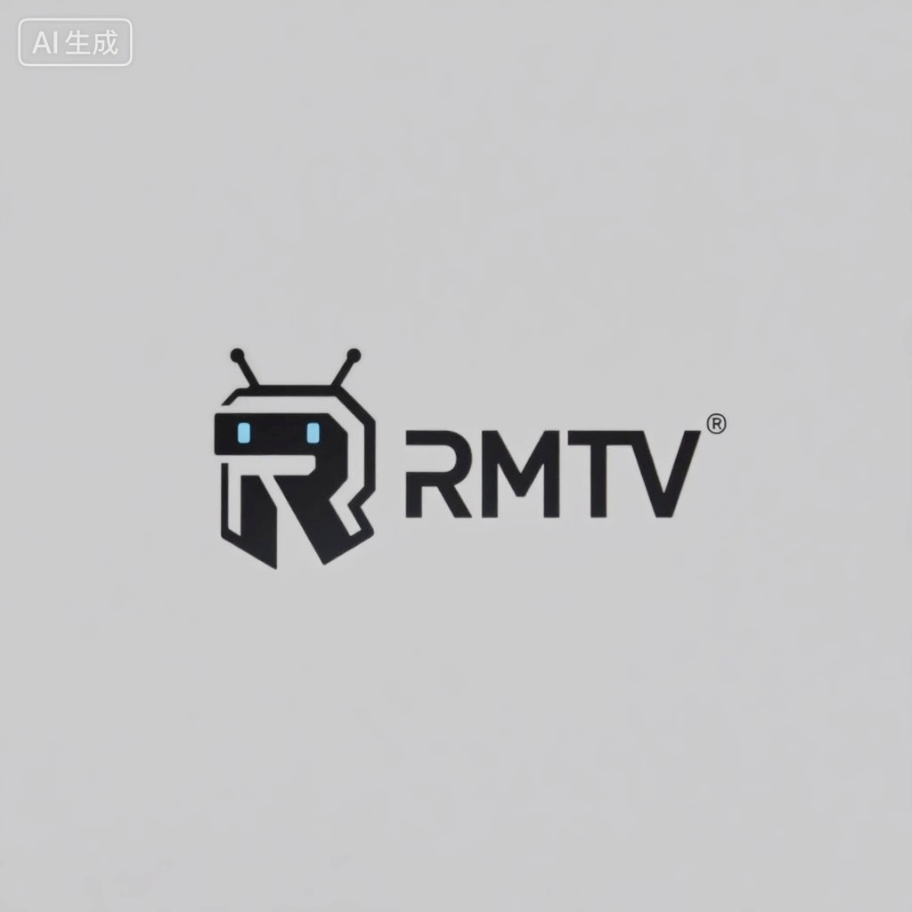
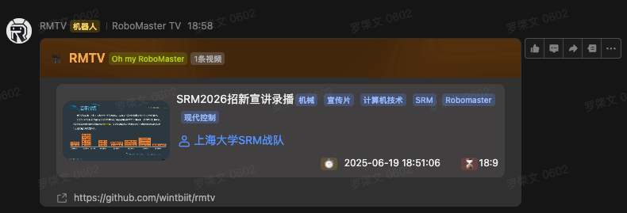

# RoboMaster TV



## Deply
### 1. 创建自建应用
https://open.feishu.cn/app

### 2. 开通机器人能力与相关权限
- `im:chat:readonly`
- `im:message`
- `im:resource`

### 3. Kubernetes
```shell
kubectl apply -f https://raw.githubusercontent.com/wintbiit/rmtv/refs/heads/main/kustomization.yaml
```

```yaml
services:
  rmtv:
    image: ghcr.io/wintbiit/rmtv:latest
    restart: always
    volumes:
      - ./data/rmtv:/app/data
    environment:
      COOKIES: "<bilibili_cookies>"
      LARK_APP_ID: "<your_app_id>"
      LARK_APP_SECRET: "<your_app_secret>"
```
填写.

### 4. Run
```bash
docker compose up -d
```
1. 机器人全自动往所有加入群灌水
2. 使用自定义机器人: `volumes`添加`- ./webhooks.txt:/app/webhooks.txt`. url填入webhooks.txt新行，自动识别，无需重启